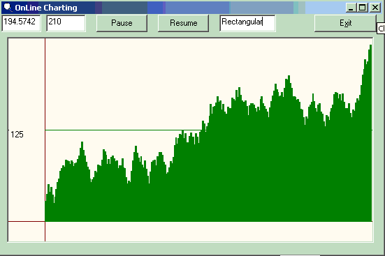



## online chart control

### Description

hi all, this code creates chart at runtime. At run time if you can change a value the chart will automatically change. u just set the values and it shows results continuously. u can use this code in any u r applications.its very smart.in this i m not using ms-chart control, everything is done by code.......but trust me the code is soo short.
 
### More Info
 

             |
---                |---
**Submitted On**   |2004-11-10 04:01:04
**By**             |[Anuj sharrma](https://github.com/Planet-Source-Code/PSCIndex/blob/master/ByAuthor/anuj-sharrma.md)
**Level**          |Beginner
**User Rating**    |5.0 (15 globes from 3 users)
**Compatibility**  |VB 6\.0
**Category**       |[Custom Controls/ Forms/  Menus](https://github.com/Planet-Source-Code/PSCIndex/blob/master/ByCategory/custom-controls-forms-menus__1-4.md)
**World**          |[Visual Basic](https://github.com/Planet-Source-Code/PSCIndex/blob/master/ByWorld/visual-basic.md)
**Archive File**   |[online\_cha18167411102004\.zip](https://github.com/Planet-Source-Code/anuj-sharrma-online-chart-control__1-57180/archive/master.zip)

